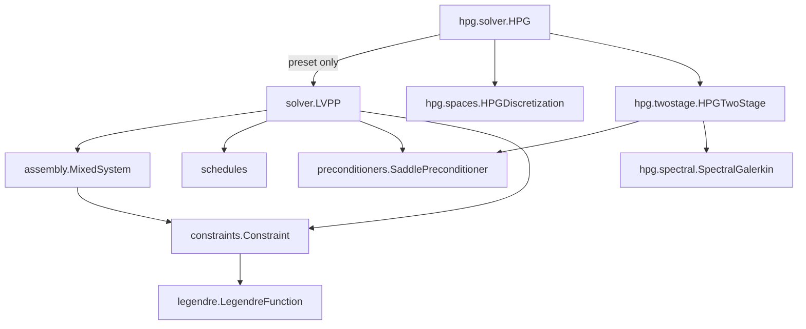

# LVPP design notes

`lvpp` implements the latent variable proximal point (LVPP) algorithm of
Dokken, Farrell, Keith, Papadopoulos, & Surowiec (2025) for finite-element
variational problems with pointwise inequality constraints, together with the
hierarchical proximal Galerkin (hpG) preset of Papadopoulos (2026).  These
notes describe the algorithm the library realizes, the layout of the code, and
the measurements behind the design choices.  Where a measured value is
compared with a value reported in one of the papers, the comparison is stated
as such.

References, by the handles used below:

- **LVPP** — Dokken, Farrell, Keith, Papadopoulos, & Surowiec (2025), "The
  latent variable proximal point algorithm for variational problems with
  inequality constraints", CMAME 445:118181 (arXiv:2503.05672).
- **pG** — Keith & Surowiec (2024), "Proximal Galerkin: a structure-preserving
  finite element method for pointwise bound constraints", Found. Comput. Math.
- **hpG** — Papadopoulos (2026), "Hierarchical proximal Galerkin: a fast hp-FEM
  solver for variational problems with pointwise inequality constraints",
  arXiv:2412.13733.

A bare section number such as §4.5 is a section of hpG; an equation number such
as (2.7a) is LVPP's.

---

## The algorithm

Every constrained unknown `u` carries a latent variable `psi`.  The unknowns
are solved together in the mixed system (2.7a)-(2.7b) of LVPP, whose discrete
form is the saddle-point system

    G = [[ A_alpha,  B        ],
         [ B^T,     -D_psi - E_beta ]]

with `A_alpha = alpha A`, `A` the primal operator of the variational problem,
`B_ij = (v_i, zeta_j)` the coupling between primal and latent basis functions,
`[D_psi]_ij = (zeta_i, e^{-psi} zeta_j)` the iterate-dependent latent mass, and
`[E_beta]_ij = beta (zeta_i, zeta_j)` a small regularizing mass.  `A`, `B` and
`E_beta` do not depend on the iterate; `D_psi` is the only block that does.

The latent variable is unconstrained, so the primal iterate is not feasible;
the bound-preserving output is the reconstruction `u_tilde = grad R*(psi)`,
which is feasible pointwise by construction for any `alpha`.  `R*` is one of
the Legendre-family dual functions in `lvpp.legendre` (Shannon lower and
upper, Fermi-Dirac, Hellinger, Gibbs simplex).  The number of proximal
iterations is independent of the mesh.

Each proximal iterate keeps two quantities that the diagnostics and the
adaptive refinement studies rely on:

- the **proximal drift**, `drift = (psi_prev - psi)/alpha`, which is the
  discrete multiplier `lambda_k` of LVPP §2.1.  It is captured before the
  `psi_prev` shift, so it refers to the iterate that was just accepted.
- the reconstruction `u_tilde`, refreshed at every accepted iterate.

The library also exposes the energy and three feasibility diagnostics:
`feasibility()` (pointwise bound violation), `complementarity()`, and
`dual_feasibility()`.

Constraints are given per unknown as `(lower, upper)` pairs, either side
possibly `None`, or as `Constraint` instances.  Multiple unknowns are
supported, and only constrained unknowns carry latent blocks.  The family-
generic surface is `Constraint.coupling_form` / `state_form` / `observable`;
`BoxConstraint` implements box bounds.  QVI bounds pass through
`Constraint.remap`, and the mixed system sees the remapped constraints while
the diagnostics use the raw ones.  Both `energy=` (a UFL 0-form) and
`residual=` (weak 1-forms) are accepted, and the two paths agree.

Newton failures are handled by `on_newton_failure="reduce_alpha"` together with
`max_consecutive_failures`; the proximal loop halves `alpha` and retries
instead of aborting.  A solve can start from the current mixed iterate rather
than from the interpolated initial guess, which the AMR studies use to amortize
re-solves.

### Alpha schedules

The step size `alpha_k` follows one of five rules, all in
`lvpp.schedules`; any callable with the same signature is accepted directly:

- `Constant` — a fixed `alpha`.
- `Geometric` — `alpha_{k+1} = r · alpha_k`.
- `Linear` — `alpha_0` at `k == 1`, otherwise `c · alpha_prev`, capped at
  `C_max`.
- `DoubleExponential` — `max(C · r^(q^k) - alpha_prev, C)`, capped at
  `alpha_max`.
- `NewtonAdaptive` — `2x` after at most four Newton iterations, `0.5x` after
  ten or more, otherwise held; capped at `alpha_max`.

`DoubleExponential` is the schedule of LVPP eq. (3.8).  Its value is evaluated
in log space, with `log_term < 700` and `y > 700` guards, because the direct
expression overflows in Python floats near `k = 19`.

The hpG paper prescribes a different sequence: a capped geometric ramp, with
`alpha_1 = 2^-7` and `alpha_{k+1} = min(sqrt(2) alpha_k, alpha_cap)` in §6.1,
§6.2 and §6.3, `alpha_{k+1} = min(sqrt(2) alpha_k, 2)` in §6.5, and
`alpha_{k+1} = 4 alpha_k` in §6.4.  (The extracted text is ambiguous between
`sqrt(2) alpha_k` and `sqrt(2 alpha_k)`; either way the sequence is a geometric
ramp.)  The ramp is expressible with `Linear`: `alpha_0 = 2^-7`, `c = sqrt(2)`,
`C_max = 2^-3` reproduces §6.1-6.2.

### Stopping rules

The paper terminates the ramp when `alpha` reaches its cap, so it never drives
`alpha` to infinity; it relies on LVPP's theorem that the iteration converges
for fixed `alpha`, sublinearly.  That criterion is a stopping rule of its own,
and the library separates it from the primal-increment test through the
`StoppingRule` protocol:

- `PrimalIncrement(tol)` — the LVPP default, constructed by `LVPP.solve(tol=...)`.
  Every recorded number in this document uses it.
- `AlphaPlateau(target)` — the hpG/paper rule, with an explicit plateau target
  and, optionally, the primal-increment guard.

The paper's criterion as literally stated (`alpha_k = alpha_{k-1}`) reaches its
plateau within a few steps, yet §6.2 reports 24 Newton iterations over the whole
run, and the two are not obviously consistent.  `AlphaPlateau` therefore takes
an explicit target rather than assuming the literal criterion, and any use of
it should be reconciled against the paper's reported step counts (§6.5 states
six proximal steps).

---

## Layout of the library

```
lvpp/lvpp/
  __init__.py            # public surface
  legendre.py            # the Legendre-family dual functions
  constraints.py         # Constraint and BoxConstraint
  schedules.py           # alpha schedules and stopping rules
  assembly.py            # ProblemSpec -> MixedSystem: F, J, Jp, diagnostic forms
  solver.py              # LVPP: proximal loop, diagnostics, public handles
  benchmarks.py          # analytic sphere-obstacle data
  preconditioners/
    __init__.py          # resolve_preconditioner(name | instance | dict)
    base.py              # SaddlePreconditioner + SaddleView (the interface)
    direct.py            # DirectFactorization (default: preonly + MUMPS-LU)
    floor.py             # DegeneracyFloor
    schur.py             # SchurFieldsplit (the floorless configuration)
  hpg/
    __init__.py          # HPG, HPGTwoStage, HPGDiscretization, SpectralGalerkin
    spaces.py            # mesh + CG_p x DQ_{p-2} spectral; uniform/graded builders
    spectral.py          # d-generic per-cell spectral-Galerkin algebra
    twostage.py          # HPGTwoStage (hpG eq. 4.5)
    solver.py            # HPG: the thin preset
```

`preconditioners/` is family-generic and `hpg/` owns everything specific to the
hpG framework; `hpg/spectral.py` and `preconditioners/floor.py` carry the
densest measurement notes.

`assembly.py` builds all the UFL once: `ProblemSpec` holds the validated inputs
(unknowns, flattened constraints with the unknown each acts on, latent spaces,
boundary conditions, energy or residual forms), and `MixedSystem` owns the
static forms (`F`, `J`), the live mixed function `z`, and the diagnostic forms
that `LVPP.solve` only reads.  `jacobian_with(extra)` returns `Jp = J + extra`,
which is how a preconditioner's regularization reaches the preconditioner
Jacobian and nothing else.

Two invariants of the mixed layout:

- primal degrees of freedom are contiguous and come first, then the latent
  blocks in constraint order.  The hpG preconditioner relies on the offset
  (`n_primal`), so the ordering is documented in the `SaddleView` docstring.
- `z` is the only mixed variable; the per-unknown subfunctions and the latent
  blocks are views onto it, so a Newton solve updates everything at once.



### The preconditioner interface

`SaddlePreconditioner` is everything `LVPP` needs to know about how the mixed
Newton system is approximately factored.  A preconditioner receives a
`SaddleView` — a read-only handoff holding the live mixed iterate `z`, the live
`alpha` constant, the live `drift`, the constraint-to-unknown map, the primal
and latent spaces, the lifted Dirichlet conditions, the true Jacobian `J`, the
Jacobian-correction hook, and the mesh.  All object-valued fields are live: the
solver mutates them in place, so a cached reference stays current and no
refresh callback is needed.  PETSc calls the PC's own `setUp` once per linear
solve, which is the natural refresh point; `HPGTwoStage` reads
`float(view.alpha)` there.

The protocol has three parts: `parameters()` returns the PETSc options merged
over `DEFAULT_SOLVER_PARAMETERS`; `install(snes, view)` performs one-time
wiring (a Python PC, a per-iterate cellwise factorization); and
`jacobian_correction(view)` returns an extra form for `Jp`.  Options-based
preconditioners implement no-ops for the latter two.  All mutable
preconditioner state is owned by the preconditioner instance; there is no
module-global context, so two preconditioners can coexist in one process.

The concrete preconditioners are:

- `DirectFactorization` — `preonly` + MUMPS LU, the default.
- `DegeneracyFloor(constant=0.0, drift=0.0, on_operator=False)` — the additive
  floor `eps(x) = constant + drift · alpha · |lambda(x)|` on the latent
  diagonal, where `lambda` is the proximal drift.  `on_operator=True` puts the
  floor on `J` instead of `Jp` and is a documented diagnostic only: it is
  measured to fail at every mesh level (`RESEARCH.md` Finding 1), and the
  recorded negative control is that it diverges with exact LU.
- `SchurFieldsplit(inner_rtol=..., inner_maxit=..., gamg=False)` — the
  floorless production configuration (fields of type `schur` / `upper`, both
  blocks MUMPS-LU), the recommended P1 setting of `RESEARCH.md` Finding 6, plus
  the CG+GAMG-on-`K` variant of `experiments/archive_2026-09/scale_up.py`.
- `RawOptions` — a plain PETSc options dictionary.

The Jp-only rule is the reason the correction hook exists: floors and
regularizations belong on the preconditioner Jacobian, never on the operator,
because the outer proximal point iteration needs exact Newton directions.  The
same rule is applied in the hpG preset, where `beta` enters the approximate
Schur complement `Shat` and not the operator.

---

## Public handles

`LVPP` exposes its PETSc objects and the mixed state through documented names,
so that experiment scripts and the checks never reach into private state:
`snes`, `ksp`, `pc`, `matrix(mat_type="aij")` (the assembled true `J` at the
current iterate), `constraints`, `primal_spaces`, `latent_spaces`, `bcs`,
`alpha_constant` (the live `Constant`), and `install_monitor(fn)`.
The live state is `z`, `u_out`, `psi_out`, `psi_prev`, `drift`, `u_tilde`,
`history`, `proximal_iterations`, `newton_iterations` and the final `alpha`.

The stable public names are `LVPP`, `LVPPConvergenceError`,
`DEFAULT_SOLVER_PARAMETERS`, `BoxConstraint`, `Constraint`, `LegendreFunction`,
`ShannonLower`, `ShannonUpper`, `FermiDirac`, `Hellinger` and `GibbsSimplex`.

Some keywords have two accepted spellings: `latent_spaces=` or the earlier
`psi_spaces=`, `alpha_schedule=` or the earlier `alpha_rule=`, and
`preconditioner=DegeneracyFloor(...)` or the earlier `psi_floor=`,
`psi_floor_drift=`, `psi_floor_operator=` and `jacobian_regularization=`.  The
earlier spellings raise a `DeprecationWarning` and are otherwise equivalent, so
the archived experiment scripts under `experiments/archive_2026-09/` and the
hpG drivers under `experiments/hpg/` remain executable.

All mixed quantities are assembled in `lvpp.assembly`; the analytic
sphere-obstacle data shared by the examples and the checks live in
`lvpp/benchmarks.py`, a module inside the package so that the checks and the
experiments outside the package root can import it.  The module also carries
the recorded P1/Schur reference tables.

---

## The hpG preset

hpG is the same latent-variable proximal point loop on a different
discretization and with a different preconditioner.  Formally it is two
orthogonal axes, and both are configuration rather than behaviour:

| axis | choice | module |
|---|---|---|
| discretization | `CG_p` primal x `DQ_{p-2}` spectral | `lvpp.hpg.spaces` |
| preconditioner | sequential `P_F` (eq. 4.5) | `lvpp.hpg.twostage` |

`HPG` is a preset builder: it chooses both axes and hands them to `LVPP`.  It
overrides no algorithm step — not the proximal loop, not the schedule, not the
stopping rule, not the Newton solver.  This is the executable test of the
decomposition: if `HPG` ever needed to override something beyond `__init__`, an
axis would be mis-modeled, and the right fix would be a genuinely different
algorithm subclass.  The two axes also compose in the other direction: any
`LVPP` user can pass `preconditioner=HPGTwoStage()` and keep their own spaces,
or take `HPGDiscretization` alone and drive it with their own preconditioner.

### Discretization

`HPGDiscretization` carries a tensor-product mesh, the degree `p`, the primal
space `CG_p` and the latent space `DQ_{p-2}` with `variant="spectral"`.
`uniform(n, p, length, dim)` builds the mesh for `dim` in 1, 2, 3
(interval / quadrilateral / hexahedron); `graded(n, p, ratio, ...)` builds a
geometrically graded chain, grading each axis independently.  Tensor-product
cells are a hard requirement (hpG §3, §7); non-Cartesian meshes are open.

The latent degree is family-dependent: `latent_degree(p, family)` returns
`p - 2` for obstacle-type constraints (`p >= 2`, [60, Lem. B.3]) and `p - 1`
for gradient-type constraints (`p >= 1`, [35, Ex. 6]).

The grading deserves a note: the archive's `graded_quad(n, ratio)` produced
meshes measuring about 1.21x the ratio it was asked for (26.414x for a
requested 21.8), so `HPGDiscretization.graded` calibrates the chain growth and
`grading_ratio()` returns the requested value.  The recorded chain is
`(64, 21.8) -> 26.41x`, `(80, 45.3) -> 55.33x`, `(96, 93.5) -> 114.78x`,
`(112, 187.0) -> 226.06x`.

Grading is per axis and rectangular; that is the deviation from viamr's
skeleton-based refinement, which is triangle-only, while hpG needs
tensor-product cells.  The same note is recorded in `experiments/hpg/RESULTS.md`
and `experiments/hpg/hpg_common.py`.

The `CG_p` space *is* the polynomial space of the hierarchical basis — P1 hats
plus Jacobi bubbles span exactly `P_p` — and the hierarchy is a basis choice.
Nothing else in the preset depends on the basis being hierarchical.

### Per-cell spectral-Galerkin algebra

`lvpp.hpg.spectral` builds the cellwise blocks that the two-stage
preconditioner factorizes.  With `d` the topological dimension, `q = p - 2` and
`k = (q+1)^d`, the 1D closed forms are

- `MY`, the Y-mass (diagonal plus a band of two);
- `SY`, the Y-stiffness, diagonal with entries `2(2n+3)`, from
  `Y_n' = -(2n+3) P_{n+1}`;
- `M_leg`, the Legendre mass, diagonal `2/(2n+1)`;
- `G`, the Y-Legendre Gram matrix, upper triangular with a band.

The per-cell blocks are tensor products with cell extents `h_1..h_d`:

    Ahat_c = alpha · sum_i (prod_{j != i} h_j / h_i) · kron_j A^(j),
             A^(i) = SY, A^(j != i) = MY
    Bhat_c = (prod_j h_j / 2^d) · kron G
    Mdiag_c = (prod_j h_j / 2^d) · kron M_leg

The 2D check is `alpha (h_y/h_x · SY x MY + h_x/h_y · MY x SY)`, exactly the
assembled `Ahat`.  The canonical flattening is
`flat = sum_a idx_a · (q+1)^(d-1-a)`, which for `d = 2` is the current
`a*(q+1) + b`.

Structure (hpG §4.5): `Ahat_c` is diagonal for `d = 1` and block-diagonal with
`2^d` parity classes per cell for `d >= 2` — the paper's "4N blocks" for
`d = 2`.  The `d = 3` count of 8 is inferred from the same parity argument and
is confirmed by the structural check.  The parity structure is verified, not
used as storage: the implementation keeps the dense `k x k` block, which is
cheap at these degrees (at most 9 in 2D and 27 in 3D for `p <= 4`).  `Shat` is
block-diagonal per cell with dense blocks of size `O(p^d)` (the paper's count;
ours is `k = (p-1)^d`), and this is where the cellwise Cholesky applies.  One
1D factor is worth recording: `Y_n' = -(2n+3) P_{n+1}` gives
`int Y_n' Y_m' = 2(2n+3) delta_nm`, whereas the paper's unscaled `W_n`
satisfies `dW_n/dx = -P_{n+1}`, so `Y_n = (2n+3) W_n`.

The Vandermonde `V = kron^{(d)} V_1` is discovered numerically once per
`(q, d)` by interpolating the probe `prod_a P_a(s_a)` into a one-cell mesh.
This is necessary because Firedrake's `DQ` spectral element has a nodal dual at
the Gauss points, so raw `Function.dat` values are not modal coefficients.  The
discovery is cross-checked by a determinant against the analytic
`kron legval(gauss, I)`.

`SpectralGalerkin(mesh, W, p, alpha)` owns `cell_blocks`, `to_modal`,
`build_shat(D_blocks, beta)`, `shat_apply`, `min_eig_negS` and
`verify_vs_firedrake()`.  Cell blocks take one documented type (a PETSc `Mat`);
`HPGTwoStage` keeps its `D` as a `Mat` and holds a separate CSR view for
matrix-vector products.

### The two-stage preconditioner

`HPGTwoStage` implements the sequential `P_F` of hpG eq. (4.5):

    y    = b_psi - B^T A_alpha^{-1} b_u
    dpsi = S^{-1} y          # inner GMRES on the true Schur complement,
                             # preconditioned by the cellwise Shat Cholesky
    du   = A_alpha^{-1} (b_u - B dpsi)

The primal action is cached: with Dirichlet rows replaced by identity rows,
`A(alpha) = alpha K0 + (1 - alpha) E` and `K0 = stiffness + E`, so
`A(alpha)^{-1} b = K0^{-1} (D_alpha b)` with `D_alpha = diag(1/alpha on
interior rows, 1 on boundary rows)`.  `K0` is factorized once per mesh, and the
identity is verified at machine precision (3.6e-15).  Two primal actions are
available: `a_action="lu"` (the default, a cached MUMPS factorization) and
`a_action="gamg"` (a capped CG + AMG solve on the same `K0`, which leaves no
global factorization on the apply path).

`E_beta` is decoupled from the operator: the paper puts `E_beta` in the
operator and calls it optional for well-posedness but useful for the condition
number, with `beta = 0` in the §6.2 refinement study and
`beta` in `{1e-8, 1e-4, 1e-6, 1e-5}` in §6.1, §6.2 (Table 1), §6.4 and §6.5.
The library instead leaves `E_beta` out of the operator and lets `beta` enter
`Shat` alone, following the Jp-only rule; the `beta` sweep
`{0, 1e-5, 1e-4, 1e-3}` is iteration-identical, so `beta = 0` is the default.
This choice is ours, not the paper's.

The inner solve is GMRES rather than CG — an earlier CG inner solve stalled on
the proximal path (`experiments/archive_2026-09/promob.py`) — with default
`rtol = 1e-4`, `max_it = 40`.  The paper prescribes no single tolerance:
Table 1 (obstacle) uses `1e-5`, Table 2 (gradient) uses `1e-3` with a
150-iteration cap, §6.4 uses `1e-7` and §6.5 uses `1e-5`.  The checks also
exercise the setting `inner_rtol=1e-6, inner_maxit=500` recorded by
`HPG_PORT_SPEC.md`; that tolerance is a setting of the recorded checks, not a
value the paper prescribes.

`E_beta` and `Shat` are family-dependent.  For obstacle-type constraints,
`E_beta = beta (zeta_i, zeta_j)_Psi` is a `Psi`-mass and `Shat` is eq. (4.6),
the triple product.  For gradient-type constraints, the paper uses
`E_beta = beta (grad_h eta_i, grad_h eta_j)_{Phi^d}`, a broken-stiffness matrix
in the `Phi` (Y) basis with `eta` in `Phi^d`, and drops the triple product:
`Shat = -D_psi - E_beta` (eq. 4.8), with `beta = 1e-5` because `S` is otherwise
nearly singular.  The formulas above are the obstacle case, and both pieces are
overridable per constraint family.

The sign convention lives in one place, in the class docstring: the
lower-bound latent block of `J` is `J_psi_psi = -D_psi`, so
`S = J_psi_psi - B^T A^{-1} B` is negative definite and
`-Shat_c = -D_jac + coupling + beta M`.

The paper's three preconditioner variants are `P_F` (two `A^{-1}` applies and
one `S^{-1}`), `P_L P_D` and `P_D` (one each).  It uses `P_F` throughout the 2D
study (Fig. 3; the cached Cholesky makes `A^{-1}` cheap) and compares all three
in 3D, where `A^{-1}` becomes iterative (CG + AMG) and fewer applications win.
`P_F` is what the library implements; `a_action="gamg"` is the 3D route.

---

## Dimension generality

The cell algebra is dimension-generic with `d` read from the mesh
(`d` in 1, 2, 3; `mesh.cell_name()` in interval / quadrilateral / hexahedron or
their tensor-product equivalents):

1. `k = (q+1)^d`, and every `kron` chain uses the same axis order as the mesh's
   `cell_node_map`.  The discovered Vandermonde depends on that order, so the
   order is re-verified per dimension and `W.dim() == ncells * k` is asserted.
2. Cell extents are per-cell vectors of length `d`; the `prod h_j` and `/ h_i`
   products replace the 2D `h_x`, `h_y` expressions.
3. For `d = 1`, `Ahat` is diagonal (all off-diagonals vanish); for `d >= 2`,
   each cell has `2^d` parity classes and the check asserts the inter-parity
   entries vanish.
4. `verify_vs_firedrake()` runs for `d` in 1, 2, 3 at `p` in 2, 3, 4.
5. The graded mesh builder grades each axis independently.

The 2D regression anchor (the recorded structural numbers in
`experiments/hpg/RESULTS.md`): the `DQ_{p-2}` modal psi-mass off-diagonal is at
most 4.1e-18; the `D_psi` entries outside the cell blocks are exactly zero
(bit-exact); the Y `Ahat` agrees with the closed form to at most 9.2e-14; and
the Y parity off-block entries are at most 3.2e-14.  The `d = 1` and `d = 3`
structure checks pass as well.

---

## Cross-check against the hpG paper

The source is Papadopoulos, arXiv:2412.13733v4 (6 Aug 2026).  Section numbers
in this section are the paper's.

### Verified against the paper

| claim | paper | status |
|---|---|---|
| hpG = LVPP + hp-FEM discretization; same saddle systems | §1, §4 intro | ✓ |
| `u` H1-conforming hierarchical (hats + Jacobi bubbles), `psi` L2-conforming discontinuous Legendre | §3, Defs 3.1/3.3 | ✓ |
| `W_n = (1-x^2) P_n^{(1,1)} / (2(n+1))`, `0 <= n <= p-2`, `dW_n/dx = -P_{n+1}` | (3.3)-(3.4) | ✓ (Jacobi identity checked: `d/dx[(1-x^2)P_n^{(1,1)}] = -2(n+1)P_{n+1}` implies `W_n' = -P_{n+1}`) |
| `Psi` mass diagonal, `(zeta_i, zeta_j) = |K_i| delta_ij / (2n+1)` (Lemma 3.2) | §3, Lem. 3.2 | ✓ matches the modal `diag = (h_x h_y / 4) · 2/(2n+1) x 2/(2m+1)` |
| `Y_n = P_n - P_{n+2}`, `Y_n(±1) = 0`, `Y_n = c_n W_n` | (3.7), §3 | ✓ (`c_n = 2n+3`) |
| obstacle pairing: `p` for `u`, `p-2` for `psi`, `p >= 2` | §4.1 | ✓ |
| gradient pairing: `p-1` for `psi`, `p >= 1` | §4.2 | ✓ |
| `G = [[A_alpha, B], [B^T, -D_psi - E_beta]]`, `A_alpha = alpha A`, `B_ij = (v_i, zeta_j)`, `[D_psi]_ij = (zeta_i, e^{-psi} zeta_j)`, `[E_beta]_ij = beta (zeta_i, zeta_j)` | (4.1)-(4.2) | ✓; the lower-bound latent block of `J` is `-D_psi`, i.e. `psi_lvpp = -psi_hpG` |
| `A`, `B`, `E_beta` parameter-independent; `D_psi` the only iterate-dependent block | §4.1, §4.3 | ✓ |
| `E_beta` not needed for well-posedness; `beta` small or zero | §4.1 | ✓ (`beta = 0` in the §6.2 refinement study, at most 1e-4 in §6.1/6.2/6.4/6.5) |
| `S = -(D_psi + E_beta + B^T A_alpha^{-1} B)`; `G^{-1} = P_R P_D P_L`; `P_F`, `P_L P_D`, `P_D` | §4.4, (4.4) | ✓ |
| `P_F` sequential solve `y = b_psi - B^T A_alpha^{-1} b_u`, `delta_psi = S^{-1} y`, `delta_u = A_alpha^{-1} (b_u - B delta_psi)` = 2 `A^{-1}` + 1 `S^{-1}` | (4.5) | ✓ exact |
| one Cholesky of `A` cached at the start of the outer solve; `A_alpha^{-1} = alpha^{-1} A^{-1}` | §4.4 | ✓ |
| 2D: always `P_F` (Fig. 3); 3D: compare `P_F` / `P_L P_D` / `P_D` with CG+AMG for `A^{-1}` | §4.4, §6.5 | ✓; the library has `P_F` and the `gamg` primal action |
| `Shat = -D_psi - E_beta - Bhat^T Ahat_alpha^{-1} Bhat`, `Ahat_alpha = alpha (grad_h eta_i, grad_h eta_j)`, `Bhat_ij = (eta_i, zeta_j)` on `Phi` (the Y basis) | (4.6)-(4.7) | ✓ |
| `Shat` block-diagonal, dense blocks of size `O(p^d)`; cellwise factorization | §4.5 | ✓ (`k = (p-1)^d` for obstacle-type constraints) |
| gradient-type `Shat = -D_psi - E_beta` (no triple product), `beta = 1e-5` | (4.8), §4.6 | ✓ |
| worst case, Fig. 4: `alpha = 1`, `beta = 0`, `D_psi` identically zero, polylog growth | §4.5 | ✓ |
| fast Legendre ↔ Chebyshev / DCT transforms | §5 | ✓ (not implemented; wall-clock work is out of scope) |
| three ill-conditioning remedies; convergence without `alpha -> infinity` | §5 | ✓ |
| non-standard `Psi`-expansion quadrature (breaks symmetry; fewer iterations than Clenshaw-Curtis) | §5 | ✓ |
| inexact solves: early termination, theory open | §5 | ✓ |
| Remark 6.1: the §6.1-6.4 linear systems are solved by sparse direct solvers | §6.1 | ✓ |
| §6.2 obstacle: 24 Newton iterations independent of `h` and `p`; GMRES 14.21-36.54 | §6.2, Table 1 | ✓ |
| §6.5 3D obstacle: `beta = 1e-5`, six proximal steps, 16 Newton iterations | §6.5 | ✓ |
| `lambda_k = (psi_{k-1} - psi_k) / alpha_k` is our `drift` | §2.1 | ✓ identical definition |
| tensor-product cells required for `d >= 2`; non-Cartesian meshes open | §3, §7 | ✓ |

### Corrections to the earlier reading of the paper

1. **`Ahat` in 1D is diagonal, not "2 parity blocks".**  The paper states that
   `Ahat_alpha` is diagonal for `d = 1` and block-diagonal with **4N** blocks
   for `d = 2`.  `2^d` parity classes is the right generalization for
   `d >= 2`; the 3D count (8) is inferred from the same parity argument and has
   since been confirmed by the structural check.

2. **There is no published inner tolerance `rtol = 1e-6, cap = 500`.**  The
   paper prescribes no single tolerance: Table 1 uses `1e-5`, Table 2 uses
   `1e-3` with a 150-iteration cap, §6.4 uses `1e-7` and §6.5 uses `1e-5`.  The
   `1e-6/500` setting is the one recorded by `HPG_PORT_SPEC.md`, not a value
   from the paper.

3. **The latent degree is family-dependent**: `p - 2` for obstacle-type
   constraints and `p - 1` for gradient-type constraints.

4. **The schedule and stopping rule are a configuration difference, not a
   shared loop setting.**  The paper's `alpha`-sequence is a capped geometric
   ramp terminated on an `alpha` plateau, while LVPP's loop stops on the primal
   increment.  The library therefore has a `StoppingRule` protocol with
   `PrimalIncrement` and `AlphaPlateau`, and records the deviation.

Two further differences are gaps in the implementation rather than
misreadings, and are recorded with the limitations below: `P_D` / `P_L P_D` are
not implemented, and `E_beta` / `Shat` are family-dependent.

### Deviations of the implementation from the paper

| # | deviation | consequence |
|---|---|---|
| 1 | the library uses LVPP's `double_exponential` (`alpha_max` 10) and a primal-increment stop; the paper uses a capped geometric ramp (`alpha <= 2^-3` in §6.1/6.2) and an `alpha`-plateau stop | Newton counts are not directly comparable with the paper's (for example §6.2 = 24).  The paper's configuration is available (`Linear` + `AlphaPlateau`) but is not what the recorded numbers use |
| 2 | the library assembles with Firedrake's symmetric quadrature at raised degree; the paper uses a non-standard `Psi`-expansion quadrature that breaks `D_psi` symmetry and reports fewer iterations than Clenshaw-Curtis | inner iteration counts can differ in either direction; the asymmetry is a paper-specific optimization, not a correctness requirement |
| 3 | the library keeps `E_beta` out of the operator and puts `beta` on `Shat` only (the Jp-only rule); the paper puts `E_beta` in the operator | both use small or zero `beta`; this choice is ours |
| 4 | the library implements `P_F` only | 3D, where `A^{-1}` is iterative, is where `P_D` / `P_L P_D` matter (§6.5); the 3D comparison is untouched |

### Outer and inner Krylov counts

The paper's Fig. 3 / Table 1 solver is `P_F` with an **inner**,
`Shat`-preconditioned GMRES for `S^{-1}`, so Table 1's 14.21-36.54 are inner
iterations per Newton step.  The paper's **outer** FGMRES count is about 1 by
construction with an accurate `S^{-1}` (§4.4: "the outer FGMRES solver would
converge in one iteration"; Table 5 reports an average FGMRES count of
1.00-2.81 in 3D).  The outer and inner counts must therefore be compared
separately.  Like for like:

- the library's inner iterations per apply are `12.8 -> 15.7 -> 27.0` for
  levels 0-2, against the paper's Table 1 range `14.21-36.54` — the same range,
  with mild growth;
- the library's outer FGMRES count is at most 2, against the paper's outer
  count of about 1-3 — the same range.

Both agree with the paper; neither is a "beat".  This is an interpretation
point only, and no measured number changes.

---

## Measurements

All numbers below are serial, measured with the analytic sphere-obstacle
problem as the common benchmark, and each row names the script that reproduces
it.  The check scripts live under `experiments/checks/`, and their docstrings
name the values they check.

| check | script | result |
|---|---|---|
| unit suite | `pytest tests/` | 8 passed |
| P1 sphere reference | `examples/sphere_lvpp.py` | prox `[8, 11, 8, 8]`; errors `1.553e-2 / 3.599e-3 / 8.375e-4` |
| P1 Signorini | `examples/signorini_lvpp.py` | `SIGNORINI EXAMPLE OK` |
| alpha schedules | `experiments/checks/check_schedules.py` | maximum difference `0.0` over 7200 grid points |
| preconditioners | `experiments/checks/check_preconditioners.py` | 20/20 |
| floorless Schur preconditioner | `experiments/checks/check_schur_pc.py` | prox/newton/error/dofs and maximum outer iterations `14/29/48` |
| earlier floor spellings | `experiments/checks/check_deprecated_paths.py` | the floored Schur configuration converges (prox 8); the operator floor still fails, the negative control for `operator_correction` |
| hpG, L0 p=2 uniform | `experiments/checks/check_hpg.py` | paper-literal setting `8 / 23 / 1.1927e-3 / outer 2 / inner 12.75` against the recorded `8 / 23 / 1.193e-3 / 2 / 12.8` |
| hpG graded chain | `experiments/checks/check_hpg_graded.py` | g4-g7 (26.4x to 226.1x, up to 12.5k cells): no divergence, outer flat at 2, inner 12-14 per apply |
| hpG spectral structure | `experiments/checks/check_spectral.py` | the recorded 2D structural numbers reproduced to the digit; `d = 1` `Ahat` diagonal; `d = 3` gives 8 parity classes |
| hpG discretization | `experiments/checks/check_hpg_spaces.py` | dimensions, grading-ratio calibration, `dim` in 1, 2, 3, and the rejection paths all pass |
| hpG matrix-free primal action | `experiments/checks/check_hpg_matfree.py` | uniform: identical with the cached-factorization path (`8 / 22 / 1.1919e-3`, A-CG 14.7 iterations per call, 0 non-converged); graded 26.4x: converges (outer 2-3) with the A-CG saturating its cap (569/569 at `a_rtol = 1e-8`; 60/602 at `1e-6`) |

The graded chain is checked with the measured ratios of the archive
(26.4 / 55.3 / 114.8 / 226.1) and asserts no divergence with bounded iteration
counts, not digit-identical counts, because the calibrated meshes differ
slightly from the archive's (same band, chains about 10% weaker).  Recorded
against observed on the chain: prox/newton `6/20, 7/19, 7/20, 8/20` against
`8/20, 7/19, 7/20, 8/20`.

### The matrix-free primal action

`HPGTwoStage(a_action="gamg")` replaces the cached MUMPS factorization of the
`alpha`-free `K0` with a capped CG + AMG solve on the same `K0`, so no global
factorization remains on the apply path; everything else (the true-Schur
matrix-vector product, the cellwise `Shat` Cholesky, the inner GMRES, the
`E_beta` decoupling) is unchanged.  The measured behaviour is:

- **uniform meshes: identical with the cached-factorization path.**  At L0 p=2
  both give prox 8, newton 22 and `err = 1.191910e-3`, with A-CG at 14.7
  iterations per call (maximum 16) and no non-converged solve.
- **graded meshes: the A-solve saturates its cap.**  On the 26.4x graded mesh,
  at `a_rtol = 1e-8` all 569 A-CG calls hit the 60-iteration cap; loosening to
  `a_rtol = 1e-6` leaves 60 of 602 saturated.  The outer FGMRES converges
  (2-3 iterations) and the result is close to, but not identical with, the
  cached-factorization path (prox 10 against 8, `err 1.03e-4` against
  `9.9e-5`).  AMG on a strongly graded stiffness matrix is weak here, and
  `a_rtol` / `a_maxit` are the controls.

---

## Limitations and open items

- No change to the mathematics is intended anywhere: the proximal loop, the
  Legendre maps, the `alpha` schedules and the diagnostics are fixed.
- The fast Legendre ↔ Chebyshev / DCT transforms of hpG §5 are not
  implemented; `experiments/hpg/RESULTS.md` is explicit that iteration counts,
  not wall-clock time, are the hpG preset's advantage.
- `P_D` and `P_L P_D` are not implemented; `P_F` is what the 2D benchmarks use,
  and the 3D preconditioner comparison of §6.5 is untouched.
- The stopping-rule default is `PrimalIncrement`.  The paper-faithful
  `Linear` schedule plus `AlphaPlateau` stopping is implemented and documented
  but is not exercised by any recorded number, and the paper's own criterion
  needs reconciling with its reported step counts before it can be relied on.
- The paper's non-standard `Psi`-expansion quadrature is not implemented; the
  assembly uses Firedrake's symmetric quadrature at raised degree.
- No MPI work beyond the recorded two-rank smoke test
  (`experiments/archive_2026-09/par_smoke.py`); the correctness claims here are
  serial.
- The four partitioned-multiphysics paradigms of
  `PARTITIONED_MULTIPHYSICS_PROXIMAL_GALERKIN.md` are out of scope.
- Non-Cartesian meshes are open (hpG §7), and the graded builder is
  rectangular and per-axis, in contrast with viamr's triangle-only
  skeleton-based refinement.
- The archived `graded_quad` meshes and the calibrated `HPGDiscretization.graded`
  meshes are not identical (chains about 10% weaker at the same band), which is
  why the graded check bounds iteration counts rather than matching digits.
- `HPG` takes an `HPGDiscretization`, or a `(mesh, p)` pair for an existing
  tensor-product mesh, rather than a bare mesh and degree: a bare mesh cannot
  say whether it is uniform or graded.
- `experiments/hpg/` is kept as the record of the reported numbers
  (`RESULTS.md` names its files), while `lvpp/hpg/` is the supported
  implementation; the duplicated machinery there is not maintained.
