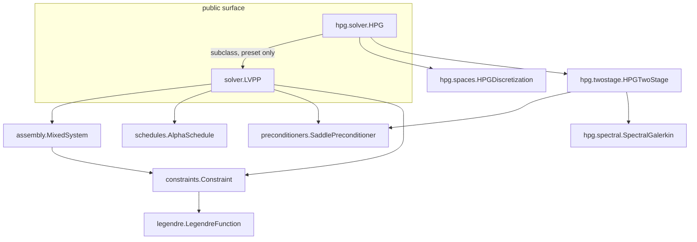

# SPEC: readable rewrite of the `lvpp` library

**Status:** implemented on branch `rewrite/human-readable` (phases 1–3 of §8);
design record, with the gate results in §14.
**Date:** 2026-09-10.
**Inputs:** `lvpp/lvpp/**` (the library), `lvpp/experiments/archive_2026-09/**`
(the frozen evidence chain), `lvpp/experiments/hpg/**` (the hpG port, gates 0–1
passed, stages 2–3 promoted), `lvpp/HPG_PORT_SPEC.md`,
`lvpp/HIERARCHICAL_PG_INTEGRATION.md`, `lvpp/RESEARCH.md`,
`ProximalGalerkin/` (the paper + reference code, at the repo root — not under
`lvpp/experiments/`). `ProximalGalerkin/hierarchicalPG.pdf` (arXiv:2412.13733v4)
was read in full; §13 records the point-by-point fidelity check and the
corrections it forced.

**Goal in one line.** Keep the mathematics and every measured number, but
rewrite the library so a reader can follow the algorithm without reading
PETSc plumbing, and so the hpG solver plugs in as a *configuration* rather than
a set of reach-ins into private state.

---

## 0. Answer to the design question, first

> *Should the hPG solver be a subclass of the more general LVPP solver?*

**Partly. Thin subclass, yes — but the difference must not live in the
subclass.** The evidence says the two solvers share the entire proximal
algorithm and the same saddle system; they differ on *independent* axes that
are configuration, not behaviour:

1. **Discretization** (mesh + spaces + basis): hpG is `CG_p` primal ×
   `DQ_{p-2}` spectral latent on tensor-product cells; LVPP is space-agnostic.
2. **Preconditioner**: hpG is the sequential `P_F` two-stage PC (eq. 4.5) over a
   cached α-independent primal factorization; LVPP's default is direct LU.
3. **Schedule and stopping rule**: the paper's α-sequence is a bounded
   geometric ramp terminated when α plateaus, not LVPP's primal-increment
   test (§4.1, §13). Configurable, not behavioural.
4. **Constraint family** (hpG-specific): obstacle-type pairs `u` with latent
   degree `p−2`; gradient-type pairs it with `p−1` and changes `E_β` and `Ŝ`
   (§5.3). Out of scope for the first rewrite, but the abstractions must not
   preclude it.

Those axes are orthogonal, and the experiments already exercise the cross
products:

| configuration | evidence |
|---|---|
| hpG spaces + **no** hpG solver (direct MUMPS control) | `hpg_common.run_direct` / `stage0_gate.direct_control` |
| hpG **preconditioner** + a different A-action | `matfree_hpG.MatfreeTwoStagePC` (CG+GAMG instead of cached LU) |
| hpG spaces + ordinary `LVPP` object, only the PC swapped | `promote_hpg.run_two_stage` — it calls `make_lvpp(...)` and replaces the PC on `snes.ksp` |

`promote_hpg.run_two_stage` is the decisive datum: the hpG *solver* is an
ordinary `LVPP` whose PC was replaced. Nothing in the proximal loop, residual,
α-schedule, convergence test, drift capture, or diagnostics changes. So:

- **Correct decomposition:** `LVPP` gains a documented **preconditioner seam**
  and an explicit discretization input; `HPG(LVPP)` is a *preset builder* that
  chooses the spaces/mesh and installs `HPGTwoStage`. It overrides no algorithm
  step.
- **What the subclass framing got right:** an `HPG` convenience entry point is
  worth having — users should not have to assemble the hpG spaces by hand.
- **What it would get wrong if taken literally:** if the hpG logic were placed
  in overridden methods, the subclass would have to override space
  construction *and* solver construction, and would still depend on base-class
  private state (`_z`, `_alpha`, `_bcs`, `_J`, `_solver.snes.ksp`) — which is
  precisely the coupling that makes the current port hard to read. The rewrite
  must remove that coupling, not formalize it.

A genuine algorithm subclass would be justified only if hpG changed the loop
*mechanics*. The paper does use a different **schedule and stopping rule** (the
α-plateau criterion of §4.1/§13, versus LVPP's primal-increment test), but that
is configuration: schedule and stopping become strategies, so `HPG` still
overrides no loop mechanics. The spec therefore makes `solve()` a readable
template method with pluggable `AlphaSchedule` + `StoppingRule`, so that a
future *real* algorithm subclass has clean hooks.

---

## 1. Current state, and why a rewrite is warranted

### 1.1 Inventory

| file | lines | contents |
|---|---:|---|
| `lvpp/lvpp/legendre.py` | 220 | `LegendreFunction` protocol + Shannon/Fermi–Dirac/Hellinger/Gibbs simplex — **well factored, keep as is** |
| `lvpp/lvpp/constraints.py` | 247 | `Constraint` (coupling/state/observable/diagnostics/remap) + `BoxConstraint` — **well factored, keep as is** |
| `lvpp/lvpp/lvpp.py` | 743 | everything else: normalization, UFL assembly, PETSc solver wiring, α rules, proximal loop, diagnostics |
| `lvpp/lvpp/__init__.py` | 20 | re-exports |

`lvpp.py` is the target. Its measured shape:

| symbol | line | note |
|---|---:|---|
| `DEFAULT_SOLVER_PARAMETERS` | 42 | keep |
| `_MAX_ALPHA_HALVINGS = 5` | 55 | **dead: redefined at line 72 to 20** |
| `_ALPHA_RULE_DEFAULTS` | 57 | five schedules |
| `_MAX_ALPHA_HALVINGS = 20` | 72 | the live value |
| `_make_alpha_rule(...)` | 79 | 55 lines, five closures |
| `_as_function_list`, `_as_form`, `_normalize_residual` | 139–191 | input normalization |
| `_as_constraint_list`, `_normalize_bounds`, `_normalize_psi_spaces` | 194–246 | input normalization |
| `class LVPP` | 249 | one class, ~495 lines |
| `LVPP.__init__` | 328–546 | ~25 `self._*` assignments; normalization + mixed form + Jp + SNES + diagnostic forms |
| `LVPP.solve` | 548–694 | proximal loop + failure handling + drift capture |
| diagnostics | 696–743 | `energy`, `feasibility`, `complementarity`, `dual_feasibility` |

### 1.2 Pain points (each with evidence)

1. **One 743-line class with five responsibilities.** `__init__` alone builds
   the spaces, the mixed space, the residual form, the Jacobian, the
   preconditioner-Jacobian (`Jp`), the SNES, and ~10 diagnostic forms.
2. **Duplicated module constant.** `_MAX_ALPHA_HALVINGS` is defined twice
   (L55, L72); the first is dead. Symptom of a file that has drifted.
3. **Preconditioner knowledge inside the general solver.** `psi_floor`,
   `psi_floor_drift`, `psi_floor_operator`, and `jacobian_regularization` are
   constructor arguments of the *general* solver, but they only mean anything
   to one preconditioner family (the degeneracy floor). Measured role:
   `psi_floor=0` is the recommended setting on the Schur path
   (`RESEARCH.md` Finding 6 "RESOLVED"), and `psi_floor_operator=True` fails at
   every level (Finding 1). The core class should not carry knobs whose
   measured best value is "off".
4. **No preconditioner seam → private-attribute coupling is the de-facto API.**
   13 archived experiment scripts and the hPG drivers must do
   `lvpp._solver.snes.ksp.getPC().setType(PYTHON)` and read `lvpp._alpha`,
   `lvpp._bcs`, `lvpp._z`, `lvpp._J`, `lvpp._spaces`, `lvpp._drift`
   (`amr_health.py`, `eps_schedule.py`, `grade_pc.py`, `growth_driver.py`,
   `promob.py`, `rankk_correction.py`, `scale_up.py`, `schur_percell.py`,
   `hpg_pc.py`, `promote_hpg.py`, …). The rewrite must expose these as public,
   documented handles.
5. **Module-global mutable PC context.** `hpg_pc.CTX = ctx` (set by the
   driver). State should live on the preconditioner instance.
6. **hpG machinery is 2D-hardcoded.** `hpg_shat.py` builds `(q+1)**2` blocks
   with `np.kron`, `CellGeometry` returns `(hx, hy)`, and the parity structure
   is described as "4 parity blocks". The paper covers 1D/2D/3D tensor-product
   cells; the library must be dimension-generic (`k = (q+1)^d`; `Ahat`
   diagonal for `d = 1`, `2^d` parity classes per cell for `d ≥ 2`).
7. **Sign conventions live in docstrings.** The LVPP lower-bound latent block is
   `-D_psi` (so `S` is negative definite), while the paper's `D_psi` is a
   positive mass ⊙ e^{−ψ}. This mapping is documented only in
   `hpg_pc.py`/`RESULTS.md`; it belongs in one place in the library.

### 1.3 What must **not** change

The measured record is the acceptance oracle. In particular:

- the LVPP residual (paper eq. 2.7a/2.7b) and the α schedules (esp. the
  log-space overflow guard in `double_exponential`, paper eq. 3.8);
- the **Jp-only rule**: floors/regularization go on the preconditioner
  Jacobian, never on the operator (`psi_floor_operator` stays a documented
  diagnostic, default off);
- `drift = (psi_prev − psi)/α` captured **before** the shift (= the discrete
  multiplier);
- `warm_start`, `on_newton_failure="reduce_alpha"`, `max_consecutive_failures`;
- `u_tilde = grad R*(psi)` (feasible by construction) and the
  feasibility/complementarity/dual-feasibility diagnostics;
- multi-unknown problems, per-unknown and multiple-per-unknown constraints,
  QVI bounds via `Constraint.remap`, residual-vs-energy parity.

---

## 2. Design principles

1. **One concept per module.** Every file readable top-to-bottom without
   jumping into PETSc.
2. **The algorithm is the spine.** `solve()` reads as the paper's pseudocode;
   everything else is support.
3. **Compose, don't override.** Discretization and preconditioning are
   strategies handed to the solver, not subclasses of it.
4. **Public handles for research.** Anything 13 experiment scripts needed
   becomes a documented property or hook.
5. **No hidden globals.** All mutable state is owned by an object.
6. **Preserve the record.** Renames provide aliases for the frozen archive;
   numbers must reproduce bit-for-bit before old code is deleted.
7. **Dimension-generic by construction.** All hpG cell algebra derives `d`
   from the mesh; nothing hardcodes 2.

---

## 3. Target layout

```
lvpp/lvpp/
  __init__.py            # stable public surface (what examples/experiments import)
  legendre.py            # UNCHANGED
  constraints.py         # UNCHANGED
  schedules.py           # alpha schedules (from _make_alpha_rule)
  assembly.py            # ProblemSpec -> MixedSystem: F, J, Jp, diagnostic forms
  solver.py              # LVPP: template-method proximal loop + diagnostics + public handles
  preconditioners/
    __init__.py          # resolve_preconditioner(name|instance|dict)
    base.py              # SaddlePreconditioner protocol + SaddleView (the seam)
    direct.py            # DirectFactorization (default: preonly + MUMPS-LU)
    floor.py             # DegeneracyFloor (additive-path PC; psi_floor lives HERE)
    schur.py             # SchurFieldsplit (Finding-6 floorless config)
  hpg/
    __init__.py          # public: HPG, HPGTwoStage, HPGDiscretization, SpectralGalerkin
    spaces.py            # mesh + CG_p x DQ_{p-2} spectral; uniform/graded builders
    spectral.py          # d-generic per-cell spectral-Galerkin algebra
    twostage.py          # HPGTwoStage preconditioner (paper eq. 4.5)
    solver.py            # HPG(LVPP): the thin preset
```

Rationale for the two subpackages: `preconditioners/` is family-generic
(direct, floor, Schur fieldsplit) and `hpg/` owns everything specific to the
paper's framework. Flattening `preconditioners/` into one file is acceptable if
each class stays under ~120 lines; the subpackage is the default because the
floor logic is measurement-dense.

Target sizes: no module over ~350 lines; `spectral.py` the largest.



---

## 4. Core abstractions

### 4.1 `schedules.py`

Preserve the exact arithmetic; change only packaging.

```python
class AlphaSchedule(Protocol):
    def __call__(self, k: int, alpha_prev: float, newton_its: int) -> float: ...

@dataclass(frozen=True)
class Constant:         C: float = 1.0
@dataclass(frozen=True)
class Geometric:        C: float = 1.0; r: float = 1.5
@dataclass(frozen=True)
class Linear:           alpha0: float = 1.0; c: float = 1.5; C_max: float = 1e10
@dataclass(frozen=True)
class DoubleExponential: C: float = 1.0; r: float = 1.5; q: float = 1.5; alpha_max: float = 10.0
@dataclass(frozen=True)
class NewtonAdaptive:   alpha0: float = 1.0; alpha_max: float = 1e6

def make_schedule(rule: str | AlphaSchedule, params: dict | None = None) -> AlphaSchedule
def describe(schedule: AlphaSchedule) -> str      # for the verbose line
```

Behavioral requirements carried over verbatim:

- `double_exponential`: evaluate `max(C·r^(q^k) − alpha_prev, C)` **in log
  space**, with the `log_term < 700` and `y > 700` guards and
  `min(..., alpha_max)`; this is paper eq. (3.8) and overflows naive Python
  floats near `k ≈ 19`.
- `linear`: `alpha0` at `k == 1`, else `c·alpha_prev`, capped at `C_max`.
- `newton_adaptive`: `2×` at `newton_its ≤ 4`, `0.5×` at `≥ 10`, else hold;
  capped at `alpha_max`.
- Callables are accepted directly.

`LVPP` keeps `alpha_rule=`/`alpha_parameters=` as the ergonomic entry and
stores a resolved `AlphaSchedule`; `alpha_rule` names remain the strings above.

**Stopping rule (paper fidelity — see §13).** The hpG paper's α-sequence is a
*capped geometric ramp* — `α_1 = 2⁻⁷`, `α_{k+1} = min(√2·α_k, α_cap)` in §6.1,
§6.2 and §6.3, `α_{k+1} = min(√2·α_k, 2)` in §6.5, `α_{k+1} = 4·α_k` in §6.4
(the PDF text extraction is ambiguous between `√2·α_k` and `√(2α_k)`; either
way a geometric ramp) —
and it terminates when **α plateaus at its cap** (`α_k = α_{k−1}`), i.e. the
paper never drives `α → ∞`; it relies on LVPP's theorem that the iteration
converges for fixed α (sublinearly). The ramp is already expressible with the
existing `Linear` schedule (`alpha0=2⁻⁷, c=√2, C_max=2⁻³` for §6.1–6.2). What
the current loop cannot express is the stopping rule — it stops only on the
primal increment, which is why the port used `double_exponential` instead
(a **documented deviation from the paper's algorithm**). Add:

```python
class StoppingRule(Protocol):
    def converged(self, k: int, alpha: float, alpha_prev: float,
                  history: dict) -> bool: ...

@dataclass(frozen=True)
class PrimalIncrement:  tol: float                     # LVPP default
@dataclass(frozen=True)
class AlphaPlateau:     target: float | None = None    # hpG / paper
```

`LVPP.solve(tol=...)` keeps constructing `PrimalIncrement(tol)`; `HPG` selects
`AlphaPlateau` (with the paper's `Linear` schedule) when asked for the
paper-faithful configuration. Both rules remain available; the recorded
numbers use `PrimalIncrement`.

One caveat: the paper's stated criterion (`α_k = α_{k−1}`) reaches its plateau
within a few steps, yet §6.2 reports 24 Newton iterations over the whole run —
the two are not obviously consistent. Implement `AlphaPlateau` with an explicit
`target` plus, optionally, the primal-increment guard, and reconcile it against
the paper's reported step counts (§6.5 states six proximal steps) rather than
assuming the literal criterion.

### 4.2 `assembly.py`

Move all UFL construction out of `LVPP.__init__`. The result is a `MixedSystem`
that owns the *static* forms and the live mixed function; `LVPP.solve` only
touches values.

```python
@dataclass(frozen=True)
class ProblemSpec:
    u: tuple[Function, ...]                 # user unknowns (validated distinct)
    constraints: tuple[Constraint, ...]     # flattened, one entry per latent block
    constraint_unknown: tuple[int, ...]     # which unknown each constraint acts on
    latent_spaces: tuple[FunctionSpace, ...]
    bcs: tuple[DirichletBC, ...]
    energy: Form | None
    residual_forms: tuple[Form, ...] | None
    residual_is_mixed: bool

class MixedSystem:
    def __init__(self, spec: ProblemSpec, alpha: Constant,
                 form_compiler_parameters: dict | None = None): ...
    # live state
    z: Function; subfunctions; z_backup; alpha
    # forms
    F: Form; J: Form
    def jacobian_with(self, extra: Form | None) -> Form   # Jp = J + extra
    # diagnostics forms (built once)
    primal_increment_forms, latent_increment_forms, energy_form
    feasibility_forms, complementarity_forms, dual_feasibility_forms
    reconstruction: list[Function]          # grad R*(psi), current
```

This absorbs L346–L523 of the current `__init__`. Two contracts preserved:

- **Ordering:** primal dofs are contiguous and come first, then latent blocks,
  in `constraint` order. The hpG PC relies on this (`field_ises`, `n0`, `n1`)
  and it must be stated in the docstring and asserted once
  (`z.dof_dset.layout_vec` ordering check, or simply documented as invariant).
- **QVI remap:** `constraints` passed to the system are `raw.remap(mapping)`;
  diagnostics use the raw constraints. Keep the split explicit, with the
  current comment promoted to a docstring.

### 4.3 `preconditioners/base.py` — the seam

This is the single most important new abstraction. It replaces the
`lv._solver.snes.ksp.getPC()` monkey-patching and the `alpha_getter` trick.

```python
@dataclass(frozen=True)
class SaddleView:
    """Read-only handoff from the solver to a preconditioner.  All fields are
    LIVE objects (Constant/Function mutate in place), so a preconditioner may
    cache the reference and read current values in its own setUp()."""
    z: Function                     # mixed iterate
    alpha: Constant                 # live proximal parameter
    primal_spaces: tuple[FunctionSpace, ...]
    latent_spaces: tuple[FunctionSpace, ...]
    bcs: tuple[DirichletBC, ...]
    jacobian: Form                  # TRUE J (never floored/regularized)
    jacobian_factory: Callable[[Form | None], Form]   # Jp builder
    n_primal: int                   # dof offset contract
    mesh: Mesh

class SaddlePreconditioner(Protocol):
    def parameters(self) -> dict: ...
        """PETSc options merged over DEFAULT_SOLVER_PARAMETERS."""
    def install(self, snes, view: SaddleView) -> None: ...
        """One-time wiring (e.g. pc.setType('python'); pc.setPythonContext(self))."""
    def finalize(self) -> None: ...
```

Design notes:

- **No `refresh` needed.** `alpha` is a live `Constant` and `z` a live
  `Function`; PETSc calls the PC's own `setUp` once per linear solve (i.e. per
  Newton linearization), which is the natural refresh point. `HPGTwoStage`
  already implements `setUp`; it reads `float(view.alpha)` there instead of via
  a driver-installed `alpha_getter`.
- **`parameters()` only for options-based PCs.** `DirectFactorization` returns
  the default LU dict and implements no-ops. `SchurFieldsplit` returns the
  Finding-6 dict. `HPGTwoStage` returns the FGMRES dict and implements
  `install`.
- **`jacobian_factory`** is how the floor/regularization reaches `Jp` without
  the core class knowing what a floor is.

### 4.4 `solver.py` — `LVPP`

```python
class LVPP:
    def __init__(self, energy=None, residual=None, u=None, bounds=None, bcs=None,
                 latent_spaces=None,                     # renamed from psi_spaces
                 preconditioner=None,                    # str | SaddlePreconditioner | dict
                 alpha_schedule="double_exponential", alpha_parameters=None,
                 solver_parameters=None, form_compiler_parameters=None,
                 options_prefix=None, increment_norm="L2",
                 on_newton_failure="raise", max_consecutive_failures=50,
                 verbose=True, name="lvpp"): ...

    def solve(self, tol=1e-8, max_proximal_iterations=100, warm_start=False): ...

    # --- diagnostics (unchanged semantics) ---
    def energy(self); def feasibility(self); def complementarity(self)
    def dual_feasibility(self)

    # --- live state (existing names kept) ---
    # z, u_out, psi_out, psi_prev, drift, u_tilde, history,
    # proximal_iterations, newton_iterations, alpha (final float)

    # --- NEW public handles (was: private reach-ins) ---
    snes: PETSc.SNES                       # property
    ksp:  PETSc.KSP                        # property
    pc:   PETSc.PC                         # property
    alpha_constant: Constant               # live; was _alpha
    constraints: list[Constraint]          # was _raw_constraints
    primal_spaces: list[FunctionSpace]     # was _spaces
    bcs: list[DirichletBC]                 # was _bcs
    def matrix(self, mat_type="aij") -> Matrix   # assembled TRUE J at current z
    def install_monitor(self, fn) -> None        # ksp.setMonitor(fn) sugar
```

`solve()` becomes a template method (still one loop, but each step named):

```python
def solve(self, tol=1e-8, max_proximal_iterations=100, warm_start=False):
    self._initialise(warm_start)
    for k in range(1, max_proximal_iterations + 1):
        alpha = self._choose_alpha(k)
        self._newton_solve(alpha)                 # SNES + reduce_alpha retries
        self._update_diagnostics(k, alpha)        # increments, feas/comp/drift
        self._shift_previous()
        if self._stopping.converged(k, alpha, alpha_prev, self.history):
            return self._finalize(k, alpha)
    raise LVPPConvergenceError(...)
```

The body of each `_step` is exactly the current code; no numerical change.
This is what makes a future genuine algorithm subclass possible without
touching the loop.

### 4.5 `preconditioners/direct.py`, `floor.py`, `schur.py`

- `DirectFactorization`: `{"ksp_type": "preonly", "pc_type": "lu",
  "pc_factor_mat_solver_type": "mumps"}`. Default.
- `DegeneracyFloor(constant=0.0, drift=0.0, on_operator=False)`: the current
  `psi_floor`/`psi_floor_drift`/`psi_floor_operator` logic moves here verbatim
  (including the `eps(x) = psi_floor + psi_floor_drift·α·|λ(x)|` form and the
  `Jp = J + floor` vs `J = J + floor` branches). `jacobian_regularization`
  becomes `DegeneracyFloor.extra_jacobian` / a general
  `Preconditioner.jacobian_correction` hook.
  **`on_operator=True` remains a documented diagnostic only** — measured to
  fail at every level (`RESEARCH.md` Finding 1); default False.
- `SchurFieldsplit(inner_rtol=1e-6, inner_maxit=..., gamg=False)`: codifies the
  floorless production config (schur / upper / use_amat False / selfp, both
  blocks MUMPS-LU; `psi_floor=0`) from `RESEARCH.md` Finding 6, plus the
  CG+GAMG-on-K variant from `scale_up.py` as an option.

### 4.6 `legendre.py`, `constraints.py`

Unchanged. They are already the model the rest of the rewrite follows:
protocol + small concrete classes, one concept per file, data (obstacle
Functions) separated from behavior.

---

## 5. The hpG subsystem (`lvpp/hpg/`)

### 5.1 `spaces.py`

```python
def latent_degree(p: int, family: str = "obstacle") -> int:
    """Latent *partial* degree for the inf-sup stable pair (paper §4.1-4.2):
    obstacle-type  -> p - 2  (p >= 2)  ([60, Lem. B.3])
    gradient-type  -> p - 1  (p >= 1)  ([35, Ex. 6])
    """

@dataclass(frozen=True)
class HPGDiscretization:
    mesh: Mesh
    p: int
    primal: FunctionSpace      # CG_p
    latent: FunctionSpace      # DQ_{p-2}, variant="spectral"
    @classmethod
    def uniform(cls, n: int, p: int, length: float = 2.0, dim: int = 2) -> "HPGDiscretization"
    @classmethod
    def graded(cls, n: int, p: int, ratio: float, band_center: float,
               band_halfwidth: float) -> "HPGDiscretization"
```

- `uniform`: `RectangleMesh(n, n, ..., quadrilateral=True)` (2D), `IntervalMesh`
  (1D), `BoxMesh(..., hexahedral=True)` (3D). Tensor-product cells are a hard
  requirement (paper limitation; state it in the docstring).
- `graded`: the current `graded_axis`/`graded_quad` helpers move here and
  become dimension-generic (grade each axis independently). Document the
  deviation from viamr SBR (triangle-only; hpG needs tensor-product cells) —
  the note already exists in `RESULTS.md` and `hpg_common.py`.
- The `CG_p` space *is* the hierarchical basis's polynomial space (P1 hats +
  Jacobi bubbles span exactly `P_p`); the hierarchy is a basis choice. Keep this
  comment — it is the single most likely thing a reader will misread.

### 5.2 `spectral.py` — d-generic rewrite of `hpg_shat.py`

Given `d = mesh.topological_dimension()`, `q = p − 2`, `k = (q+1)^d`:

- 1D closed forms (keep, quadrature-verified): `MY` (Y-mass: diag + ±2 band),
  `SY` (Y-stiffness: **diagonal** `2(2n+3)`, from `Y_n' = −(2n+3)P_{n+1}`),
  `M_leg` (Legendre mass diag `2/(2n+1)`), `G` (Y–Legendre Gram, upper
  triangular band).
- Per-cell blocks via tensor products with cell extents `h_1..h_d`:
  - `Ahat_c = α · Σ_{i=1..d} (Π_{j≠i} h_j / h_i) · ⊗_j A^{(j)}`,
    `A^{(i)} = SY`, `A^{(j≠i)} = MY`. (2D check: `α(hy/hx · SY⊗MY + hx/hy · MY⊗SY)`
    — exactly the current `SpectralGalerkin.Afull`.)
  - `Bhat_c = (Π h_j / 2^d) · ⊗ G`.
  - `Mdiag_c = (Π h_j / 2^d) · ⊗ M_leg`, flattened.
- Canonical ordering: `flat = Σ_a idx_a · (q+1)^(d−1−a)`, matching the current
  2D `a*(q+1)+b`.
- Structure (paper §4.5): `Ahat_c` is **diagonal when `d = 1`** and
  **block-diagonal with `2^d` parity classes per cell when `d ≥ 2`** — the
  paper's "4N blocks" for `d = 2`; `d = 3` gives 8, inferred from the same
  parity argument [INFERENCE]. Kept as a *verification* (inter-parity entries
  ≈ 0, and for `d = 1` all off-diagonals), not as storage; the dense `k×k`
  block is the implementation (k ≤ 9 at p ≤ 4 in 2D, k ≤ 27 at p = 4 in 3D;
  document the cost). `Ŝ` is block-diagonal per cell with dense blocks of size
  `O(p^d)` (the paper's count; ours is `k = (p−1)^d`) — this is where the
  cellwise Cholesky applies. Note the 1D factor: `Y_n' = −(2n+3)P_{n+1}` gives
  `∫Y_n'Y_m' = 2(2n+3)δ_nm`, whereas the paper's *unscaled* `W_n` satisfies
  `dW_n/dx = −P_{n+1}` (so `Y_n = (2n+3)W_n`).
- `Vandermonde(q, d)`: `V = ⊗^{(d)} V_1`, discovered numerically once per
  `(q, d)` by interpolating the probe `Π_a P_{a}(s_a)` into a one-cell mesh
  (Firedrake's `DQ` spectral has a **nodal dual** at Gauss points — raw
  `Function.dat` values are not modal coefficients). Keep the determinant
  cross-check against the analytic `⊗ legval(gauss, I)`.
- `SpectralGalerkin(mesh, W, p, alpha)`: `cell_blocks`, `to_modal`,
  `build_shat(D_blocks, beta)`, `shat_apply`, `min_eig_negS`, and
  `verify_vs_firedrake()` (d-generic; same assertions as today).

Fixes to carry in:

- **Resolve the `cell_blocks` type bug found in `promote_hpg.py`.** That driver
  had to subclass `SpectralGalerkin` (`SGDriver`) because `HPGTwoStagePC.setUp`
  passed a scipy `csr_matrix` into `cell_blocks`, which expected a PETSc `Mat`.
  The library version takes one documented type (recommend: PETSc `Mat`, and
  the PC keeps `ctx.D` as a `Mat` while holding a separate csr view for
  matvecs). No driver-side dispatch.
- **Delete the `hpg_pc.CTX` global.** The context is an attribute of the
  `HPGTwoStage` instance.

### 5.3 `twostage.py` — `HPGTwoStage(SaddlePreconditioner)`

Implements the paper's sequential `P_F` (eq. 4.5):

```
y    = b_psi − Bᵀ A_α⁻¹ b_u
dpsi = S⁻¹ y          # inner GMRES on the true Schur, PC = cellwise Ŝ Cholesky
du   = A_α⁻¹ (b_u − B dpsi)
```

with:

- **Cached α-independent primal factorization.** With Dirichlet rows replaced by
  identity rows, `A(α) = α·K0 + (1−α)·E`, `K0 = stiffness + E`, so
  `A(α)⁻¹ b = K0⁻¹ (D_α b)` with `D_α = diag(1/α interior, 1 on bc rows)`.
  Factor `K0` once per mesh; verified at machine precision (3.6e-15).
  Provide both `a_action="lu"` (default) and `"gamg"` (the `matfree_hpG` arm).
- **E_β decoupled (this is our finding, not the paper's).** The paper puts
  `E_β` in the operator and calls it optional for well-posedness but useful to
  reduce the condition number; it is used with `β = 0` in §4.1/§6.2's
  refinement study but `β ∈ {10⁻⁸, 10⁻⁴, 10⁻⁶, 10⁻⁵}` in §6.1, §6.2 (Table 1),
  §6.4, §6.5. Our measured choice is `E_β ≡ 0` in the operator with `beta`
  entering only `Ŝ` (the Jp-only rule); the β-sweep `{0, 1e-5, 1e-4, 1e-3}` is
  iteration-identical, so `beta=0` is the default.
- **Inner solver: GMRES** (not CG — the measured proximal stall in `promob.py`),
  default `rtol=1e-4, max_it=40` (the capped-inexact discipline that rescued the
  p=4 wedge). **The paper prescribes no single tolerance**: Table 1 (obstacle)
  uses `rtol=1e-5`; Table 2 (gradient) uses `rtol=1e-3` with a 150-iteration
  cap; §6.4 uses `1e-7`; §6.5 uses `1e-5`. Expose `inner_rtol`/`inner_maxit`,
  and keep the port's literal arm (`1e-6`/`500`, the `HPG_PORT_SPEC.md`
  setting) selectable — it is a harness choice, **not** a paper setting.
- **Preconditioner variants.** The paper's three choices are `P_F` (two `A⁻¹`
  applies + one `S⁻¹`), `P_L P_D`, and `P_D` (one each). It uses `P_F` only in
  2D (Fig. 3; the cached Cholesky makes `A⁻¹` cheap), and compares all three in
  3D where `A⁻¹` becomes iterative (CG + AMG) and fewer applications win. The
  port implements `P_F` only — record `P_D`/`P_L P_D` as a gap, and keep
  `a_action="gamg"` as the 3D route.
- **E_β and Ŝ are family-dependent.** For obstacle-type,
  `E_β = β·(ζ_i, ζ_j)_Ψ` (a Ψ-mass) and `Ŝ` is eq. 4.6 (the triple product).
  For gradient-type, the paper uses `E_β = β·(∇_h η_i, ∇_h η_j)_{Φ^d}` — a
  broken-**stiffness** matrix in the `Φ` (Y) basis, with `η ∈ Φ^d` — and
  **drops** the triple product: `Ŝ = −D_ψ − E_β` (eq. 4.8), with `β = 10⁻⁵`
  because `S` is otherwise nearly singular. The formula above is the obstacle
  case; keep `E_β`/`Ŝ` overridable per constraint family.
- **Sign convention documented in one place:** lvpp's lower-bound latent block
  is `J_psi_psi = −D_psi`, so `S = J_psi_psi − BᵀA⁻¹B` is negative definite and
  `−Ŝ_c = −D_jac + coupling + β·M`. Put this table in `twostage.py` and link it
  from `RESULTS.md`.

### 5.4 `solver.py` — `HPG(LVPP)`

```python
class HPG(LVPP):
    """hpG preset: CG_p x DQ_{p-2} spectral on tensor-product cells with the
    sequential P_F preconditioner (Papadopoulos, arXiv:2412.13733, sec 4.4-4.5).
    Overrides no algorithm step; see the module docstring for the
    discretization/preconditioner axes."""
    def __init__(self, mesh, p, u, bounds, *, bcs=None,
                 preconditioner=None,   # default HPGTwoStage()
                 **lvpp_kwargs):
        disc = HPGDiscretization(mesh, p)
        super().__init__(u=u, bounds=bounds, bcs=bcs,
                         latent_spaces=[disc.latent], preconditioner=..., **lvpp_kwargs)
```

**Rule:** if implementing `HPG` requires overriding anything besides
`__init__`, stop — it means an axis was mis-modeled. This is the concrete test
of the §0 decision.

Provide `HPG.discretization` so callers/tests can reach `disc.primal` /
`disc.latent`.

---

## 6. Dimension generality

Checklist for a d-generic library (d ∈ {1,2,3}):

1. `d = mesh.topological_dimension()`; assert `d in (1, 2, 3)` and
   `mesh.cell_name() in {"interval", "quadrilateral", "hexahedron"}` (or the
   tensor-product equivalents).
2. `k = (q+1)**d`; every `np.kron` chain built with the same axis order as the
   mesh's `cell_node_map`.
3. `CellGeometry` returns per-cell extents `h` of length `d`; `Π h_j`, `/h_i`
   products replace the 2D `hx`, `hy` expressions.
4. `d = 1`: `Ahat` diagonal (all off-diagonals zero); `d ≥ 2`: `2^d` parity
   classes per cell, verification asserts inter-parity ≈ 0.
5. `verify_vs_firedrake` runs for d=1,2,3 at p=2,3,4 and must reproduce the
   stage-0 numbers for d=2 (the regression anchor).
6. `graded_quad` generalizes to per-axis grading.

Regression anchor (2D, `RESULTS.md` stage 0): `DQ_{p-2}` modal psi-mass
off-diagonal ≤ 4.1e-18; `D_psi` off-cell-block = 0.0 bit-exact; Y `Ahat` vs
closed form ≤ 9.2e-14; Y parity off-block ≤ 3.2e-14.

---

## 7. Public API and compatibility

### 7.1 Stable names (unchanged)

`LVPP`, `LVPPConvergenceError`, `DEFAULT_SOLVER_PARAMETERS`, `BoxConstraint`,
`Constraint`, `LegendreFunction`, `ShannonLower`, `ShannonUpper`, `FermiDirac`,
`Hellinger`, `GibbsSimplex`.

### 7.2 Renames and moves

| old | new | compatibility |
|---|---|---|
| `LVPP(psi_spaces=...)` | `LVPP(latent_spaces=...)` | `psi_spaces` accepted as an alias (used by `hpg_common.make_lvpp`) |
| `psi_floor`, `psi_floor_drift`, `psi_floor_operator` | `preconditioner=DegeneracyFloor(...)` | kwargs kept as **deprecated aliases** that construct the floor PC — the frozen archive (`eps_schedule.py`, `growth_driver.py`, `matfree_fieldsplit.py`, `rankk_correction.py`, `schur_*.py`, `par_smoke.py`, `amr_health.py`, `grade_pc.py`, `scale_up.py`, `promob.py`, `schur_percell.py`) must keep running |
| `jacobian_regularization=` | `Preconditioner.jacobian_correction` | alias kept |
| `lv._solver.snes` / `.ksp` | `lv.snes` / `lv.ksp` | private attr kept as an alias for one cycle |
| `lv._alpha` | `lv.alpha_constant` | alias kept |
| `lv._z` | `lv.z` | `lv.z` already public |
| `lv._bcs` | `lv.bcs` | new |
| `lv._raw_constraints` | `lv.constraints` | new; tests use `lvpp._raw_constraints[0]` → update tests |
| `lv._spaces` | `lv.primal_spaces` | new |
| `lv._J` | `lv.matrix()` | new |
| `hpg_pc.CTX` | `HPGTwoStage` instance state | no alias (global removed) |
| `hpg_common.py` / `hpg_shat.py` / `hpg_pc.py` | `lvpp/hpg/{spaces,spectral,twostage}.py` | drivers become thin imports |

The alias policy is deliberate: the archive is the evidence chain, and it must
remain executable. Aliases emit a `DeprecationWarning` and are slated for
removal once the archive is frozen *and* no longer run (or re-pointed).

### 7.3 Target user-facing code

```python
# level-1 obstacle, unchanged look
lv = LVPP(energy=0.5 * inner(grad(u), grad(u)) * dx, u=u, bounds=(phi, None),
          bcs=bc, alpha_schedule="double_exponential")
lv.solve(tol=1e-4)
lv.u_tilde[0]                       # feasible by construction

# hpG: same problem, high-order preset
from lvpp.hpg import HPG
hp = HPG(mesh=RectangleMesh(16, 16, 2.0, 2.0, quadrilateral=True), p=2,
         u=u, bounds=(phi, None), bcs=bc)
hp.solve(tol=1e-4)

# composition, both directions
LVPP(..., preconditioner="schur")                    # Finding-6 floorless config
LVPP(..., preconditioner=HPGTwoStage(inner_rtol=1e-4, inner_maxit=40))
lv.install_monitor(fn)              # what 13 scripts needed
```

---

## 8. Migration plan

Each phase is gated by reproducing an existing number.

**Phase 0 — freeze the oracle.** Record the regression set: `pytest
lvpp/tests/test_lvpp.py`; `examples/sphere_lvpp.py` (prox counts [8,11,8,8]);
`examples/signorini_lvpp.py`; the P1 floorless table
(8/21/1.553e-2, 11/23/3.599e-3, 8/19/8.375e-4) and the hpG tables in
`RESULTS.md`. No code change.

**Phase 1 — split `lvpp.py`, zero behavior change.** Create `schedules.py`,
`assembly.py`, `solver.py`; keep `LVPP`'s signature and private attribute
names as temporary aliases. Delete the duplicate `_MAX_ALPHA_HALVINGS`.
Gate: Phase-0 regression identical.

**Phase 2 — preconditioner seam + public handles.** `SaddlePreconditioner`,
`SaddleView`, `DirectFactorization`, `DegeneracyFloor`, `SchurFieldsplit`;
public `snes`/`ksp`/`pc`/`matrix()`/`constraints`/`primal_spaces`/`bcs`/
`alpha_constant`. Gate: P1 floorless table identical; the Schur config
reproduces 14/29/48 outer its.

**Phase 3 — promote hpG into the library.** Move `hpg_common`/`hpg_shat`/
`hpg_pc` machinery to `lvpp/hpg/`, d-generic; add `HPG(LVPP)`. Fix the
`cell_blocks` type bug; remove `CTX`. Gate: `RESULTS.md` uniform table
(L0 p2 8/23, 1.193e-3, outer max 2; L1/L2 outer 2), β-sweep identical, graded
chain clean (g4–g7, no divergence), stage-0 structural table reproduced for
d=2; new d=1 and d=3 structure checks pass. Report inner and outer Krylov
counts separately and compare them like-for-like against the paper (§13.4).

**Phase 4 — cleanup.** Update the three non-frozen examples and the
`experiments/hpg/*` drivers to the public API; prune the temporary private
aliases (keep deprecated kwargs); refresh `README.md` and the `RESEARCH.md`
code map; delete superseded notes.

---

## 9. Acceptance criteria

- `LVPP.__init__` has ≤ ~15 parameters; `psi_floor*` and
  `jacobian_regularization` are no longer among them.
- No module exceeds ~350 lines; no duplicated module constants.
- `solve()` reads as the paper's loop (named steps), with `warm_start`,
  `reduce_alpha`, drift capture, and the convergence test preserved.
- No reach-ins: `scripts/examples` use only public handles; no module-global
  mutable PC context exists.
- `HPG` overrides nothing but `__init__`.
- Every Phase-0 oracle number reproduces.
- The paper-faithful configuration exists and is measured: `Linear` α-schedule
  (`alpha0=2⁻⁷, c=√2, C_max=2⁻³`) + `AlphaPlateau` stopping; its Newton count
  on the §6.2 benchmark is reported against the paper's 24. This is a
  *diagnostic*, not a pass/fail gate — the recorded port numbers use LVPP's
  `double_exponential` schedule (§13).
- hpG spectral structure verified for d = 1, 2, 3 at p ∈ {2,3,4}.
- One sign-convention table, in the library, referenced by the docs.
- The frozen archive's scripts still import and run (deprecated aliases).

## 10. Non-goals

- No change to the mathematics: proximal loop, Legendre maps, α schedules,
  diagnostics.
- No new constraint families or Legendre functions.
- No new performance work (the paper's fast DCT transforms remain future work;
  `RESULTS.md` is explicit that iteration counts, not wall, are hpG's win).
- No MPI work beyond the recorded 2-rank smoke (`par_smoke.py`); correctness
  claims remain serial.
- The four partitioned-multiphysics paradigms in
  `PARTITIONED_MULTIPHYSICS_PROXIMAL_GALERKIN.md` are out of scope; the seam
  introduced here is what would make them implementable later.

## 11. Risks

| risk | mitigation |
|---|---|
| Deprecated kwargs drift / alias rot | one release of aliases, `DeprecationWarning`, tracked in Phase 4 |
| Seam perturbs measured PC timing/behavior | port the PC logic literally first (Phase 2 keeps `alpha_getter` semantics as a live `Constant` read), compare numbers before simplifying |
| d-generic `spectral.py` regresses 2D | keep the closed-form 1D matrices and the `verify_vs_firedrake` assertions; 2D stage-0 numbers are a hard gate before 1D/3D |
| `kron` axis order mismatch vs Firedrake `cell_node_map` | the discovered Vandermonde already depends on it; re-verify per d, and assert `W.dim() == ncells * k` |
| Archive scripts break | aliases + gate that they still run |
| `HPG` grows behavior | the "overrides only `__init__`" rule, checked in review |

## 12. Open questions

1. **Flatten `preconditioners/`?** One file (`preconditioner.py`) is more
   readable if the floor/Schur logic stays short; the subpackage is safer given
   the comment density of the floor measurements. Recommend subpackage.
2. **`z` ordering contract.** Should the library *assert* primal-first
   contiguous dofs (cheap check at construction), or only document it? The hpG
   PC depends on it; an assertion is worth the one-time cost.
3. **`SchurFieldsplit` in the library or left in the archive?** It is the
   recommended production P1 config (`RESEARCH.md` Finding 6). Promoting it
   makes it a supported path; leaving it keeps the library small. Recommend
   promote, since the hpG PC is being promoted and they answer the same
   question.
4. **Where do the analytic benchmark data live?** `sphere_lvpp`'s
   `psiUFL`/`uexactUFL` are duplicated in `hpg_common.py` and several archive
   scripts. A `lvpp/benchmarks/sphere.py` would remove the duplication without
   touching the frozen archive.

---

## 13. Paper-fidelity cross-check

Source: Papadopoulos, *Hierarchical proximal Galerkin: a fast hp-FEM solver for
variational problems with pointwise inequality constraints*, arXiv:2412.13733v4
(6 Aug 2026), read in full. Section numbers below are the paper's.

### 13.1 Verified against the paper

| spec claim | paper | status |
|---|---|---|
| hpG = LVPP + hp-FEM discretization; same saddle systems | §1, §4 intro | ✓ |
| `u` H¹-conforming hierarchical (hats + Jacobi bubbles), `ψ` L²-conforming discontinuous Legendre | §3, Defs 3.1/3.3 | ✓ |
| `W_n = (1−x²)P_n^{(1,1)}/(2(n+1))`, `0 ≤ n ≤ p−2`, `dW_n/dx = −P_{n+1}` | (3.3)–(3.4) | ✓ (Jacobi identity checked: `d/dx[(1−x²)P_n^{(1,1)}] = −2(n+1)P_{n+1}` ⇒ `W_n' = −P_{n+1}`) |
| `Ψ` mass diagonal, `(ζ_i,ζ_j) = |K_i|δ_ij/(2n+1)` (Lemma 3.2) | §3, Lem. 3.2 | ✓ matches the port's modal `diag = (h_xh_y/4)·2/(2n+1)⊗2/(2m+1)` |
| `Y_n = P_n − P_{n+2}`, `Y_n(±1)=0`, `Y_n = c_n W_n` | (3.7), §3 | ✓ (`c_n = 2n+3`) |
| obstacle pairing: `p` for `u`, `p−2` for `ψ`, `p ≥ 2` | §4.1 | ✓ |
| gradient pairing: `p−1` for `ψ`, `p ≥ 1` | §4.2 | ✓ |
| `G = [[A_α,B],[Bᵀ,−D_ψ−E_β]]`, `A_α = αA`, `B_ij=(v_i,ζ_j)`, `[D_ψ]_ij=(ζ_i,e^{−ψ}ζ_j)`, `[E_β]_ij=β(ζ_i,ζ_j)` | (4.1)–(4.2) | ✓; the port's lower-bound latent block is `−D_ψ`, i.e. `ψ_lvpp = −ψ_hpG` |
| `A`, `B`, `E_β` parameter-independent; `D_ψ` the only iterate-dependent block | §4.1, §4.3 | ✓ |
| `E_β` not needed for well-posedness; β small/zero | §4.1 | ✓ (β=0 in the §6.2 refinement study, ≤1e-4 in §6.1/6.2/6.4/6.5) |
| `S = −(D_ψ+E_β+BᵀA_α^{-1}B)`; `G^{-1} = P_R P_D P_L`; `P_F`, `P_LP_D`, `P_D` | §4.4, (4.4) | ✓ |
| `P_F` sequential solve `y = b_ψ−BᵀA_α^{-1}b_u`, `δ_ψ = S^{-1}y`, `δ_u = A_α^{-1}(b_u−Bδ_ψ)` = 2 `A^{-1}` + 1 `S^{-1}` | (4.5) | ✓ exact |
| cache one Cholesky of `A` at the start of the outer solve; `A_α^{-1} = α^{-1}A^{-1}` | §4.4 | ✓ |
| 2D: always `P_F` (Fig. 3); 3D: compare `P_F`/`P_LP_D`/`P_D` with CG+AMG for `A^{-1}` | §4.4, §6.5 | ✓; port has `P_F` + a `gamg` A-action |
| `Ŝ = −D_ψ−E_β−B̂ᵀÂ_α^{-1}B̂`, `Â_α = α(∇_hη_i,∇_hη_j)`, `B̂_ij=(η_i,ζ_j)` on `Φ` (Y basis) | (4.6)–(4.7) | ✓ |
| `Ŝ` block-diagonal, dense blocks `O(p^d)`; cellwise factorization | §4.5 | ✓ (`k=(p−1)^d` for obstacle in our implementation) |
| gradient-type `Ŝ = −D_ψ−E_β` (no triple product), `β=10⁻⁵` | (4.8), §4.6 | ✓ |
| worst-case Fig. 4: `α=1`, `β=0`, `D_ψ≡0`, polylog growth | §4.5 | ✓ |
| fast Legendre↔Chebyshev/DCT transforms | §5 | ✓ (not implemented; wall work is a non-goal) |
| three ill-conditioning remedies; converges without `α→∞` | §5 | ✓ |
| non-standard `Ψ`-expansion quadrature (breaks symmetry; fewer iterations than Clenshaw–Curtis) | §5 | ✓ |
| inexact solves: early termination, theory open | §5 | ✓ |
| Remark 6.1: §6.1–6.4 linear systems by sparse direct solvers | §6.1 | ✓ |
| §6.2 obstacle: 24 Newton independent of `h,p`; GMRES 14.21–36.54 | §6.2, Table 1 | ✓ |
| §6.5 3D obstacle; `β=10⁻⁵`; six proximal steps; 16 Newton | §6.5 | ✓ |
| `λ_k = (ψ_{k−1}−ψ_k)/α_k` = our `drift` | §2.1 | ✓ identical definition |
| tensor-product cells required for `d ≥ 2`; non-Cartesian open | §3, §7 | ✓ |

### 13.2 Corrections applied to this spec

1. **`Ahat` in 1D is diagonal, not "2 parity blocks"** (§5.2, §6). The paper
   states `Â_α` is diagonal for `d=1`, block-diagonal with **4N** blocks for
   `d=2`. `2^d` parity classes is the right generalisation for `d ≥ 2`; the 3D
   count (8) is an inference from the same parity argument [INFERENCE].
2. **No "published inner discipline `rtol=1e-6, cap=500`"** (§5.3). The paper
   prescribes no single tolerance: Table 1 `1e-5`, Table 2 `1e-3` (+150 cap),
   §6.4 `1e-7`, §6.5 `1e-5`. `1e-6/500` is the port's harness choice.
3. **Latent degree is family-dependent** (§5.1): `p−2` obstacle, `p−1`
   gradient.
4. **Schedule + stopping rule are a configurable difference, not "no loop
   change"** (§0, §4.1). The paper's α-sequence is a capped geometric ramp
   terminated on α-plateau; LVPP's loop can only stop on the primal increment.
   Added `StoppingRule` (`PrimalIncrement`, `AlphaPlateau`) and documented the
   port's deviation.
5. **`P_D`/`P_LP_D` are missing** from the port (§5.3); recorded as a gap.
6. **`E_β`/`Ŝ` differ by constraint family** (§5.3): obstacle uses a Ψ-mass and
   the triple product; gradient uses a broken-stiffness `E_β` in `Φ^d` and
   drops the triple product.

### 13.3 Port-vs-paper deviations the rewrite must document

| # | deviation | consequence |
|---|---|---|
| 1 | Port uses LVPP's `double_exponential` (α_max 10) + primal-increment stop; paper uses a capped geometric ramp (`α ≤ 2⁻³` in §6.1/6.2) + α-plateau stop | Newton counts are **not** directly comparable to the paper's (e.g. §6.2 = 24). The rewrite must offer the paper's configuration (§4.1) |
| 2 | Port assembles with Firedrake's symmetric quadrature at raised degree; paper uses a non-standard `Ψ`-expansion quadrature that *breaks* `D_ψ` symmetry and reports fewer iterations than Clenshaw–Curtis | inner iteration counts can differ in either direction; the asymmetry is a paper-specific optimisation, not a correctness requirement |
| 3 | Port forces operator `E_β ≡ 0` and puts `β` on `Ŝ` only (our Jp-only finding); paper puts `E_β` in the operator | both use small/zero β; the port's choice is ours and must be labelled as such |
| 4 | Port implements `P_F` only | 3D (`A^{-1}` iterative) is where `P_D`/`P_LP_D` matter (§6.5) |

### 13.4 A correction owed to the port record (outer vs inner GMRES)

`RESULTS.md` / `HPG_PORT_SPEC.md` compare the port's **outer FGMRES** ("max 2
its, FLAT") against the paper's "14–36 avg its (Table 1)". That is
apples-to-oranges: the paper's Fig. 3 / Table 1 solver is `P_F` with an **inner**
`Ŝ`-preconditioned GMRES for `S^{-1}`, so Table 1's 14.21–36.54 are *inner*
iterations per Newton step. The paper's *outer* FGMRES count is ≈1 by
construction with an accurate `S^{-1}` (§4.4: "the outer FGMRES solver would
converge in one iteration"; Table 5 shows Avg. FGMRES 1.00–2.81 in 3D).

The like-for-like comparison is therefore:

- port inner its/apply `12.8 → 15.7 → 27.0` (L0–L2) vs paper Table 1
  `14.21–36.54` — **same range**, mild growth;
- port outer FGMRES max 2 vs paper outer ≈1–3 — **same range**.

Both are consistent with the paper; neither is a "beat". The rewrite's Phase-3
gate and any write-up should state the outer/inner pairing explicitly, and the
correction should be carried back into the port docs when they are next
touched. This is an interpretation fix only — no measured number changes.

---

## 14. Implementation status (branch `rewrite/human-readable`)

Phases 1–3 of §8 are implemented. New package layout:

```
lvpp/lvpp/
  schedules.py  assembly.py  solver.py  benchmarks.py
  preconditioners/{__init__,base,direct,floor,schur}.py
  hpg/{__init__,spaces,spectral,twostage,solver}.py
```

`lvpp/lvpp/lvpp.py` was deleted (content redistributed; it remains at
`git show main:lvpp/lvpp.py`, and every deprecated kwarg/attribute still works
as an alias, per §7.2).

### 14.1 Gates (all run on the branch)

| gate | script | result |
|---|---|---|
| unit suite | `pytest tests/` | 8 passed (baseline: 8 passed) |
| P1 sphere oracle | `examples/sphere_lvpp.py` | prox `[8,11,8,8]`; err `1.553e-2 / 3.599e-3 / 8.375e-4` — identical |
| P1 Signorini | `examples/signorini_lvpp.py` | `SIGNORINI EXAMPLE OK` |
| alpha schedules | `experiments/rewrite_checks/check_schedules.py` | max diff `0.0` over 7200 grid points |
| preconditioner seam | `check_preconditioners.py` | 20/20 |
| floorless Schur PC | `check_schur_pc.py` | prox/newton/err/dofs and max outer its `14/29/48` reproduce |
| deprecated floor paths | `check_deprecated_paths.py` | floored Schur converges (prox 8); operator floor still fails (negative control for `operator_correction`) |
| hpG L0 p=2 uniform | `check_hpg.py` | paper-literal arm `8 / 23 / 1.1927e-3 / outer 2 / inner 12.75` vs recorded `8/23/1.193e-3/2/12.8` |
| hpG graded chain | `check_hpg_graded.py` | g4–g7 (26.4x→226.1x, to 12.5k cells): no divergence, outer flat at 2, inner 12–14/apply |
| hpG spectral structure | `check_spectral.py` | 2D stage-0 numbers reproduced to the digit; `d=1` Ahat diagonal; `d=3` → 8 parity classes (the §6 inference, now measured) |
| hpG discretization | `check_hpg_spaces.py` | dims, ratio calibration, `dim ∈ {1,2,3}`, rejections all pass |
| hpG matfree arm | `check_hpg_matfree.py` | uniform: identical to the cached-LU arm (`8 / 22 / 1.1919e-3`, A-CG 14.7 its/call, 0 non-converged); graded 26.4x: converges (outer 2–3) with the A-CG saturating its cap (569/569 at `a_rtol=1e-8`; 60/602 at `1e-6`) |

### 14.2 Deviations from this spec (recorded)

1. **`graded` calibrates the grading.** The archive's `graded_quad(n, ratio)`
   measured ~1.21x its request (26.414x for a requested 21.8). The rewritten
   `HPGDiscretization.graded` calibrates the chain growth so
   `grading_ratio() == ratio`. The graded gate therefore passes the archive's
   *measured* ratios (26.4/55.3/114.8/226.1) and asserts *no divergence with
   bounded iterations*, not digit-identical counts (the meshes differ slightly:
   same band, ~10% weaker chains). Recorded vs observed on the chain:
   `6/20, 7/19, 7/20, 8/20` prox/newton vs `8/20, 7/19, 7/20, 8/20`.
2. **`HPG(discretization, u, bounds, ...)`** takes an `HPGDiscretization` (or a
   `(mesh, p)` tuple) rather than `HPG(mesh, p, ...)` (§5.4 sketch): a bare
   mesh and degree cannot say whether the mesh is uniform or graded.
3. **`benchmarks.py` is a module inside the package** (`lvpp.benchmarks`)
   rather than `lvpp/benchmarks/`, so it is importable from the checks and
   experiments, which live outside the package root.
4. **`experiments/hpg/` is retained** as the port's evidence of record
   (`RESULTS.md` names its files); `lvpp/hpg/` supersedes it as the supported
   implementation. Deleting the duplicated port machinery is the open Phase-4
   decision.
5. **The stopping-rule default is still `PrimalIncrement`.** The paper-faithful
   `Linear` schedule + `AlphaPlateau` stopping (§4.1, §13.3) is implemented and
   documented but not yet exercised as a gate: every recorded number uses the
   LVPP `double_exponential` scheme, and §13.3 item 1 notes the paper's own
   criterion needs reconciling with its reported step counts before it can be
   asserted.
6. **`P_D` / `P_L P_D` remain unimplemented** (§5.3, §13.3 item 4). `P_F` is
   what the 2D benchmarks use; the 3D comparison is untouched.
7. **The matfree arm is implemented** — `HPGTwoStage(a_action="gamg")` is
   §5.3's `a_action` option, i.e. `matfree_hpG.py`'s CG+AMG replacement for the
   cached factorization of the alpha-free `K0`.  It was the one piece of that
   driver not covered by a committed gate; `check_hpg_matfree.py` now covers
   it.  Its graded behaviour is *not* equal to the cached arm (§14.1), and the
   gate reports the saturated A-CG rather than failing, because the outer
   FGMRES is designed to absorb a variably-accurate `A^{-1}` — and does.
